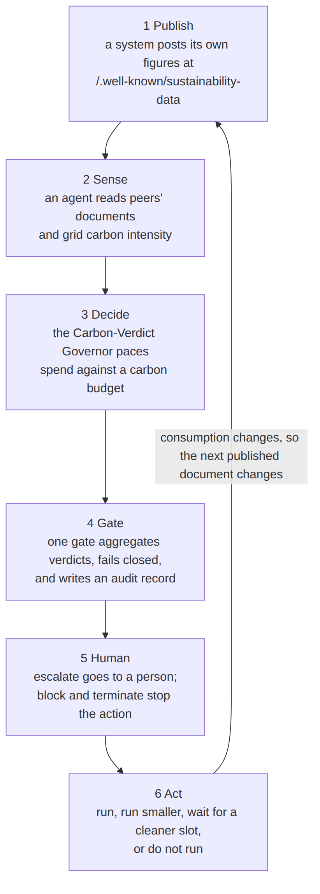

# sustainability-loop-eval

## What this is

This is the evaluation package for the article *The Cybernetic Sustainability
Loop: Governed Agentic Systems on a Sustainability Data Plane* (Andrei N.
Besleaga, 2026). It contains the code, the data and the results behind every
number the article states, so you can check them or re-run them yourself. It is a
reference architecture with an early evaluation — work in progress, not something
running in production anywhere.

## The idea in plain words

- Websites already publish `robots.txt`. Imagine they also published how much energy they use and how dirty that energy is.
- The address is `/.well-known/sustainability-data` — one small JSON file per system.
- Then any software can *read* how clean another system is running right now.
- An agent uses that reading to decide whether to do a piece of work now, later, smaller, or not at all.
- The decision is not a yes/no. It is a **ladder**: allow, degrade, escalate, block, terminate — in that order, worst always wins.
- One **gate** applies the ladder to every action, records the decision, and never fails open.
- A **person** has to approve anything above "degrade". Block and terminate just stop.
- Doing the work changes how much energy the system used — which changes what it publishes next. That is the loop.



## What we found

The honest version, with the numbers and the catches together.

- **The safety properties hold in shipped code.** Nine executable checks against the real gate, all green over 10,994 cases. The gate always picks the worst verdict, refuses on bad input instead of allowing, never runs anything above "degrade" without a human, and its audit log catches tampering.
- **The data plane is real and cheap to read.** Twelve live documents, all valid, median 44.6 ms and about 1.3 kB per fetch.
- **The governor cuts emissions.** About 16% less carbon in winter and 20% less in summer than just running everything, against 1.5% and 3.0% for ordinary carbon-aware scheduling.
- **But it does less work to get there.** Around 15% of tasks run in a reduced mode and some are dropped. Read the emissions column next to the completed and dropped columns, never alone.
- **It paces a budget; it does not cap it.** Half the days still end over budget, because work deferred past midnight spends the next day's allowance.
- **Humans are the bottleneck.** Roughly 19 to 30 approvals a day in the simulation. Dropping the approval rate from 100% to 80% cuts the charging saving almost proportionally.
- **The peer signal is biased.** It tracks the real grid closely in shape but sits low in level, so it is good for choosing *when* to run and not yet good for setting an absolute budget.
- **The workload is made up.** Task arrivals, energy per task and the EV fleet are stipulated numbers, not measurements. Real loads would move the percentages.
- **The gateway is the author's own.** No independent organization publishes into it yet. Discovery and comparability are shown; adoption is not.
- **The approvers are simulated.** Real human friction, delay and fatigue are untested.

## Try it in 30 seconds

```bash
node -v          # 22 or newer
npm install      # one dependency: the real governance gate
npm run demo     # one real document -> one real verdict
npm run agent    # optional: a real model proposes, the real gate decides (OPENROUTER_API_KEY in .env)
```

## What happens when you run it

| Command | What it does | Headline result |
|---|---|---|
| `npm run demo` | Reads one real document from the public gateway, turns its carbon figure into an estimate for one action, sends it through the real gate, prints the verdicts. Falls back to a saved copy offline, and says so. | A real verdict in seconds |
| `npm run agent` | A real language model (`anthropic/claude-sonnet-5` via OpenRouter, plain HTTPS, no SDK) reads a real peer document and proposes a task. The proposal goes through the same real gate. If the verdict is `escalate`, **you** approve or refuse at the terminal. Needs `OPENROUTER_API_KEY` (put it in a gitignored `.env`); without one it explains and exits. | You are the human in the loop |
| `npm test` / `npm run fitness` | Nine architecture checks through the real `kaiban-distributed` gate. | 9/9 green over 10,994 cases; the runtime's own suite passes 71/71 at commit `17ad362` |
| `npm run dataplane` | Fetches and checks every document the public gateway serves, five times each, then summarises the gateway's real request logs. | 12 documents, 100% valid, all 8 mandatory fields on each, median 44.6 ms and 1296.5 bytes, not-endorsed notice on 9/9 real-organization documents, 2 organizations honestly recorded as publishing nothing, 120 requests from 26 clients over the roughly one-week log window |
| `npm run simulate` | Replays a made-up agent workload over real Great Britain grid data, January and July 2026, under three policies and ten random seeds. | At an 80% budget: **−16.45%** carbon in winter and **−20.27%** in summer versus always running, against **−1.54%** and **−2.97%** for plain threshold deferral. 7996.6 and 7698.8 of about 8075 tasks completed; 1238.2 and 1220.9 run reduced; 545.7 and 853 human decisions over 28 days (about 19 and 30 a day); 14 and 14.4 of 28 days over budget. Peer signal matches the real grid at r = 0.96 and 0.986. |
| `npm run charging` | Fifty electric cars shift *when* they charge, never how much, under the gate and a human approval. The patented demand-shaping mechanism the article cites as provenance is **not** implemented or simulated here (ADR-011). | **32.51%** of charging emissions avoided in winter and **16.04%** in summer at full approval; **25.93%** and **12.77%** at 80% approval |
| `npm run fetch-traces` | Fetches and caches the real grid data. Run once. | Two 28-day windows, 1344 half-hour slots each, zero gaps |
| `npm run arch` | Draws the import graph. | Shows the core has no edges out |

Every number above is produced by a script and written to `results/`. Read
[`results/fitness.md`](results/fitness.md),
[`results/dataplane.md`](results/dataplane.md),
[`results/simulation.md`](results/simulation.md) and
[`results/charging.md`](results/charging.md) for the full tables and the caveats
that go with them.

## What this could mean — by the numbers (indicative, not a forecast)

All of this comes from `results/simulation.json` and `results/charging.json`. It
is a simulation on a made-up workload over one country's grid. Treat it as an
order of magnitude, not a prediction.

**Emissions, versus running everything immediately** (28-day windows, ten seeds,
percentage of tasks completed in brackets):

| Budget setting | Winter | Summer |
|---|---|---|
| Loosest budget (100% of the always-run median) — *worst case for saving, best for work done* | **−10.86%** (100% of tasks completed) | **−11.72%** (98.7% completed) |
| Middle budget (80%) | **−16.45%** (99.0% completed) | **−20.27%** (95.3% completed) |
| Tightest budget (60%) — *best case for saving, worst for work done* | **−25.22%** (92.7% completed) | **−33.37%** (86.6% completed) |
| Plain carbon-aware baseline (threshold deferral) | −1.54% (100% completed) | −2.97% (100% completed) |

**Charging shift, per session:** 32.51% avoided in winter and 16.04% in summer at
full approval; 25.93% and 12.77% at 80% approval. The worst of those four is
**13%**, and every car still charges fully either way.

**Energy (derived here, not a measured column).** A degraded run uses 40% of the
energy, so it saves 60%; a dropped task saves all of it. At the 80% budget:

- Winter: (1238.2 degraded × 0.6 + 78.5 dropped) ÷ 8075.1 tasks = **10.2%** of workload energy not spent.
- Summer: (1220.9 × 0.6 + 376.3) ÷ 8075.1 = **13.7%** not spent.

**One normalized illustration.** The winter trace averages **152.9 gCO2e/kWh**
(`meanNationalActualGPerKWh` in `results/simulation.json`). So per **1,000 kWh of
requested agentic workload** on that grid:

- Always run it all: 1,000 × 152.9 g ≈ **153 kg CO2e**, and all 1,000 kWh is spent.
- Governor at the 80% budget: 153 × (1 − 0.1645) ≈ **128 kg**, about **25 kg avoided** — and only about 900 kWh is actually spent, because 1% of the work is dropped and 15% runs reduced.
- Governor at the loosest budget: 153 × (1 − 0.1086) ≈ **136 kg**, about **17 kg avoided**, with every task completed.

Money is not modelled here at all. Cost savings follow whatever you pay for
electricity, so any euro figure would be an assumption, not a result.

**The limits, once more:** synthetic workload, one grid, one country, two 28-day
windows, ten seeds, simulation. And scaling this across many services is the
*point* of the architecture — it is **not** measured here, and nothing in this
repository supports a worldwide or planet-scale number.

## Run the evaluation

| Question in the article | Folder | Command | What it is |
|---|---|---|---|
| Does the architecture hold its properties? | `fitness/` | `npm test` | nine executable **architecture fitness functions** run through the *shipped* `kaiban-distributed` gate (npm 2.0.0) |
| Is the data plane usable as a control signal? | `dataplane/` | `npm run dataplane` | **live measurement** of every document on the public gateway, plus real request logs |
| What does the governor do on real grid conditions? | `simulation/` | `npm run simulate`, `npm run charging` | **trace-driven simulation** on real Great Britain half-hourly carbon intensity (NESO, CC BY 4.0), governor versus baselines; gated EV-charging shift |
| The reference core itself | `governor/` | — | [`carbon-governor.js`](governor/carbon-governor.js) (under 70 lines, imports nothing) plus `gate.js` (wires it into the real gate) |
| Why the novelty claims are worded as they are | [`docs/SEARCH-PROTOCOL.md`](docs/SEARCH-PROTOCOL.md) | — | sources, phrasings and dates of the adversarial prior-art search |

`npm run all` runs fitness, then dataplane, then simulate, then charging.

Simulation and fitness are deterministic — fixed past windows, seeded random
numbers, an injected clock — so re-running reproduces `results/*.json` byte for
byte. The data-plane step is live: latency will differ, nothing else should.

## About kaiban-distributed

`kaiban-distributed` is an open-source distributed agent runtime. It ships the
`ActionGate` and the hash-chained `AuditLog` that this package imports from npm at
version 2.0.0 and uses as the real enforcement point. Nothing here mocks it.

The **carbon validator is a reference implementation living in this repository**.
It is not merged into the runtime and is not part of any release of it.

You do **not** need a full deployment of that runtime — Docker, Redis or Kafka
brokers, the board, running agents — to reproduce anything here. The gate is
in-process code and its semantics do not depend on a broker. A carbon-governance
example inside the runtime's own examples repository is future work.

## API keys and network

Everything runs offline from cached data except these:

| Command | Reaches | Key needed |
|---|---|---|
| `npm run dataplane` | the public gateway | none |
| `npm run fetch-traces` | the NESO Carbon Intensity API | none, keyless |
| `npm run demo` | one document from the gateway (saved copy if offline) | none |
| `npm run agent` | the gateway and the OpenRouter API | `OPENROUTER_API_KEY` (in `.env`, gitignored) |

Export the key in your shell; never commit it. If you keep it in a `.env` file,
that file is git-ignored.

## Where the budget's "should" comes from

The article's normative layer — the criteria a budget is judged against — comes from
the author's *Sustainability-First Consensus* framework (Communications of the ACM,
in press), generalized in the article from ledgers to any long-running software
system. This package evaluates the loop beneath that layer (signal plane, governor,
gate, actuation); it does not evaluate or reproduce the framework itself.

## What is real and what is simulated — read this first

- **Real:** the governance gate and audit log (shipped code, imported, not mocked); the gateway documents and their conformance; the request logs; the carbon-intensity traces.
- **Reference implementation:** the Carbon-Verdict Governor core (`governor/`) — the article's specification made executable here; it is *not* merged into any released runtime.
- **Synthetic, and labeled as such in every result file:** the agentic workload, the EV fleet, the simulated human approver; the three regional "peer" series are the API's forecasts.
- The gateway is the author's own reference deployment; its real-organization documents are mapped by the author from public reports (each carries an in-band not-endorsed disclaimer).

## Folder map

| Folder | What is in it |
|---|---|
| `governor/` | The reference core and the adapter that plugs it into the real gate |
| `fitness/` | Nine architecture checks, the seeded random generator, the tiny actuation harness |
| `simulation/` | The two trace-driven experiments and their shared plumbing |
| `dataplane/` | Live measurement of the gateway and analysis of its real request logs |
| `demo/` | One command, one document, one verdict |
| `agent/` | The same with a real language model, and you on the approval step |
| `data/` | Cached inputs: grid traces, fetched documents, raw request logs |
| `results/` | Committed outputs: one JSON and one short plain reading per experiment |
| `docs/` | Architecture, product spec, decision records, research questions, search protocol, inventory |

## Architecture docs


- [**Architecture (arc42)**](docs/architecture/ARCHITECTURE.md) — all twelve sections: goals, constraints, context, strategy, building blocks, runtime, deployment, cross-cutting concepts, decisions, quality, risks, glossary.
- [**Product design**](docs/architecture/PRODUCT.md) — what it is for, numbered requirements, user stories, use cases.
- [**C4 diagrams**](docs/architecture/c4/README.md) — six pictures with their Mermaid sources: [context](docs/architecture/c4/c4-context.png), [containers](docs/architecture/c4/c4-container.png), [components](docs/architecture/c4/c4-component.png), [a governed decision](docs/architecture/c4/runtime-governed-decision.png), [a simulated day](docs/architecture/c4/runtime-simulated-day.png), [the loop](docs/architecture/c4/loop-overview.png).
- [**Decision records**](docs/adr/) — fifteen short notes on why each choice was made.
- [**Development guide**](docs/DEVELOPMENT.md) — how to run, extend, keep determinism, regenerate results, and cite.
- [**Research questions**](docs/RESEARCH-QUESTIONS.md) — the three questions, what would prove each wrong, the current answers, the limits.
- [**Fitness functions**](docs/FITNESS-FUNCTIONS.md) — what each of the nine checks and why it matters.
- [**Search protocol**](docs/SEARCH-PROTOCOL.md) — how the novelty claims were tested by trying to refute them.
- [**Artifact inventory**](docs/ARTIFACT-INVENTORY.md) — every artifact the article cites, where it lives, how its figure was checked.

## Principles

- **Hexagonal core.** The governor knows nothing about HTTP, charging protocols or approval boards. Swap every adapter and the core is unchanged. A check enforces it.
- **Fail closed.** A broken check or a nonsense input becomes `block`, never `allow`.
- **A human where it is irreversible.** Nothing above "degrade" runs without an explicit approval.
- **Determinism.** No wall clock, no live network, no unseeded randomness in anything that produces a result.
- **Honesty labels.** Real, reference and synthetic are named everywhere, including inside the result files.
- **Simplicity.** One dependency, no build step, small files, a core you can read in one sitting.

## Status and roadmap

Work in progress. The data plane is live and measured; the ladder and gate are
implemented and tested where they ship; the carbon validator is a reference
implementation evaluated here and not merged anywhere; the wiring from the gate to
a real approval board is designed, not built; the charging-protocol tool servers
are separate prototypes and are not evaluated here.

What would change the numbers, roughly in order of how much:

1. A real agentic workload replacing the made-up one.
2. Real approvers instead of simulated ones.
3. Independent organizations publishing their own documents, so the peer signal is not a stand-in.
4. More regions, more windows, more countries, more seeds.
5. A live charging-protocol call behind the gate instead of a simulated one.

The open problem is the loop actually closing between independent parties. That
is why the convention is published rather than kept.

## Original, verifiable work

The claims here rest on the author's own public artifacts and on numbers this
package regenerates: the IETF Internet-Draft with its live gateway and libraries,
the kaiban-distributed runtime and its shipped gate, the carbon-governor reference
implementation, the fitness functions, the live measurements, the simulations on
real grid data, and the co-invented patent cited as provenance. Every number can be
regenerated with one command, every property re-run, every artifact fetched. Judge
the work by what runs.

## Citation and license

Cite the article, and this package as its replication material. Machine-readable
metadata is in `CITATION.cff`.

Copyright © 2026 Andrei N. Besleaga. Code is MIT-licensed; all documentation,
text, diagrams, figures and result write-ups in this repository are © Andrei N.
Besleaga, all rights reserved — please cite the article (and the Zenodo DOI) when using them; carbon-intensity data © National Energy System Operator,
CC BY 4.0.
