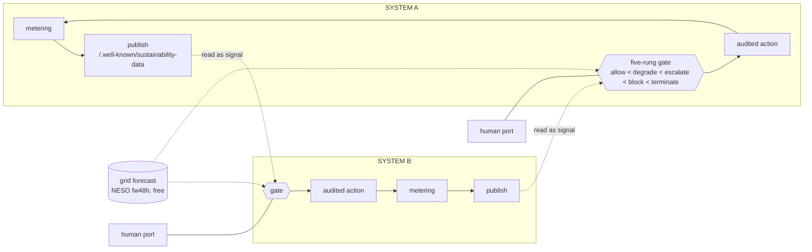
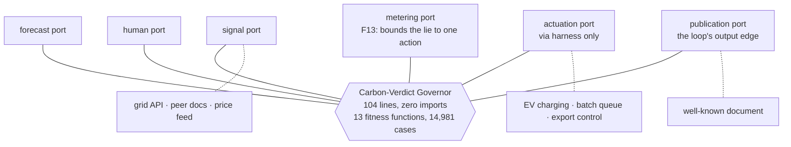

# The Executive Case — honest numbers, and why this is worth building

> One page of claims, every number measured in [`results/`](../results/) or fetched and
> cited on the date shown. Written 2026-09-01, after the audit, the bounds calculus and
> the first closed-loop simulations. The submitted article is unchanged by this file.
> The long form: [ROADMAP](ROADMAP.md); the execution manual: [RUNBOOK](RUNBOOK.md).

## What it is, in one diagram



Systems publish their own live sustainability data at a standard web address; other
systems read it and a governed gate turns it into action; the action changes the next
document. `robots.txt` with numbers, for carbon — and, within everything verified,
**no other standard occupies this role** (the closest, `tcs.json`, is annual
estimates; the clouds' carbon APIs are per-tenant and weeks delayed).

## The hexagon it runs on



## The honest numbers (all measured here, all reproducible byte-for-byte)

| what | result | where |
|---|---|---|
| The gate's safety properties in shipped code | **13/13 fitness functions over 14,981 cases** — worst-verdict-wins, fail-closed, human-bound, tamper-evident, metering bounds a lying agent to one action of slack | `results/fitness.md` |
| Pure temporal deferral (E2, 6 h, half deferrable) | **−1.54% / −2.97%** — and the ceiling calculus says ≤6.58%/8.44% causal, so the mechanism was never going to carry the story on GB's flat grid | `results/simulation.md`, `results/bounds.md` |
| Shifting a load that can really move (E3, EVs overnight) | **32.85% / 16.53%** avoided — but decomposed: winter 21% is peak-avoidance, summer clean-seeking is **negative** (−4.9 pp) | `results/charging.md`, `results/bounds.md` |
| What governance costs in carbon | **−0.34 / −0.49 pp** in E3 — the gate buys authority, audit and a bounded human cost (545.7/853 decisions per window; 442.9/637 under one tiering rule), not grams | `results/charging.md` |
| Ceilings for every future claim | E2 up to **48.06%/51.22%** at 48 h oracle; a perfect signal worth **~1 pp** over the free forecast; interruptibility **~0.3 pp** in E3 | `results/bounds.md` |
| **E5 — the closed loop, first measurement** | the published plane spreads the herd **only by paying grams**; fresh mutual observation **oscillates** (daily complete swaps at N≥5); the effect **washes out as N grows** → information alone is not enough, allocation (the gate) is the missing half | `results/loop.md` |
| **E6 — routed charging (when AND where), first simulation of its kind** | routed argmin beats best-home by up to **+78.01 pp** forecast-scored — and the tool itself prints the Goodhart warning: a region publishing zero attracts *all* the load | `results/routing.md` |
| **E6b — the runtime re-homes to green grids** | **64.42% avoided vs fixed home with 3 moves in 28 winter days**; switch-cost sweep 0→20 kWh costs almost nothing | `results/routing.md` |
| NESO's forecast, graded from public pairs | **MAPE 6.55% / 8.25%** (horizon caveat stated — not a 48 h figure) | ROADMAP §3b |

## Why it is new (verified absences, not adjectives)

1. **No standard URI for runtime self-published sustainability metrics** exists besides
   the Internet-Draft this implements — checked against carbon.txt (links only),
   tcs.json (annual), W3C WSG (no endpoint), GSF SCI (a metric, no transport).
2. **No production system routes vehicles on grid carbon** — Google eco-routing
   optimises the vehicle, not the grid; Tesla's Charge on Solar is temporal-home-only.
   E6 is the first such simulation on real regional series that we could find.
3. **The thundering herd is named and never measured across independent actors** —
   CarbonScaler declares it out of scope in print; CarbonFlex scopes it inside one
   cluster. E5 measures it, and R11/R18 already put numbers and a legal citation
   (SI 2021/1467's mandated randomised delay) behind it.
4. **The anti-herd comparison itself** — paced budget vs mandated-randomness intent
   vs the naked plane, run head-to-head, appears nowhere in the checked record. Run
   here (2026-09-02), it **falsified our own conjecture**: depletion sheds or
   reshuffles, it does not spread — the herd is bounded by capacity semantics, which
   is the corrected claim this work now carries (`results/loop.md`, finding 4).
5. **F13's metering theorem** (the lie bounded to one action, or unbounded without a
   meter) — stated and proven here, found nowhere else.

## Why it can pay (anchors fetched 2026-09-01)

- **Carbon priced as carbon is pennies** — ~£3.15/night for a 50-EV fleet at UK ETS
  £58.27/t. Said first, so nothing is built on it.
- **The same schedule is money in time-of-use markets:** the argmin moves **333.3 kWh/night** out of the 16:00–19:00 block; Agile documents sub-2p troughs against a
  100p cap; Octopus already aggregates **1 GW across 150,000 EVs**; the DFS now
  procures **bi-directionally in 12 zones**; and GB paid **£116m in H1 2025** to curtail
  the very region the router keeps choosing — routed load monetises as constraint
  relief, and flexibility markets exist to collect it.
- **The governor is a token/£ budget enforcer with zero code changes** — the ladder
  never asks what the budget counts; the degrade rung is an immediate API-bill lever
  (Sprout's >40% is the published precedent).
- **The audit chain is compliance product** — per-action, tamper-evident records in a
  world of CSRD reporting and an ISO-standard SCI (ISO/IEC 21031:2024).
- **For the planet, the honest sentence is:** this architecture does not conjure
  savings; it makes electric loads *legible and governable* so the real levers —
  shifting what can move, shrinking what cannot, soaking curtailment, and proving it
  all happened — can operate across organisations, at the layer (73.2% of GHG is
  energy; data centres alone heading 415→~945 TWh by 2030) where legibility is the
  bottleneck.

## Who it serves

| audience | what they get | measured basis |
|---|---|---|
| Operators of agentic AI | budgets (carbon/£/tokens) their agents cannot bypass, with audit; mutual back-pressure instead of stampedes | fitness suite; E5 |
| Businesses | ToU arbitrage + smaller bills + CSRD-grade evidence as a by-product | §2g anchors; audit chain |
| Households | paid participation (SEG/Outgoing/DFS turn-UP verified) with authority kept local — `block` means "not my battery, not tonight", recorded | C13/C14; E3's safety inversion |
| Grids | demand that answers signals *without* synchronising into shadow peaks — the E5 finding is exactly why allocation-aware demand is worth paying for | E5; Bailey et al.; SI 2021/1467 |
| The planet | the missing feedback wire between systems that consume a measurable share of world electricity — deployed on web conventions that demonstrably do get adopted | §3c; adoption evidence |

## What to run to see it (no network, byte-reproducible)

```bash
npm test          # 13 fitness functions, every safety property, live doc checks
npm run bounds    # the ceilings every claim must sit under
npm run loop      # E5 — the closed loop's three findings
npm run routing   # E6/E6b — when-and-where, with the Goodhart warning it prints itself
npm run demo      # a real published document → the real gate → a verdict, in seconds
```

The fifteen scenarios these compose into: ROADMAP §3e. The plan and prompts to build
the rest: RUNBOOK. The paper stays exactly as submitted; this file is what grew up
around it, with every departure logged.
