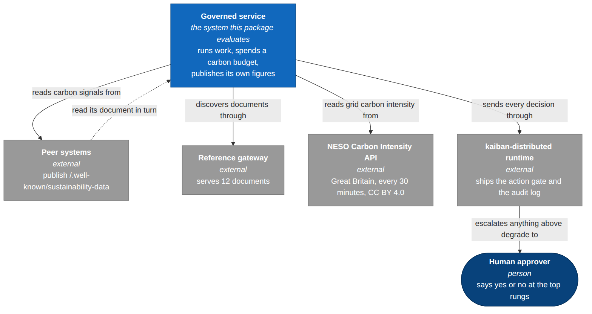
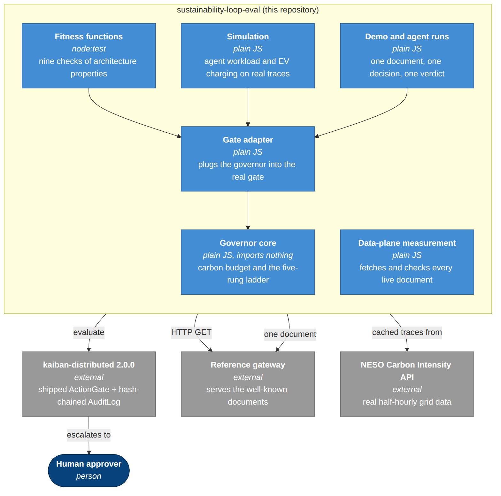
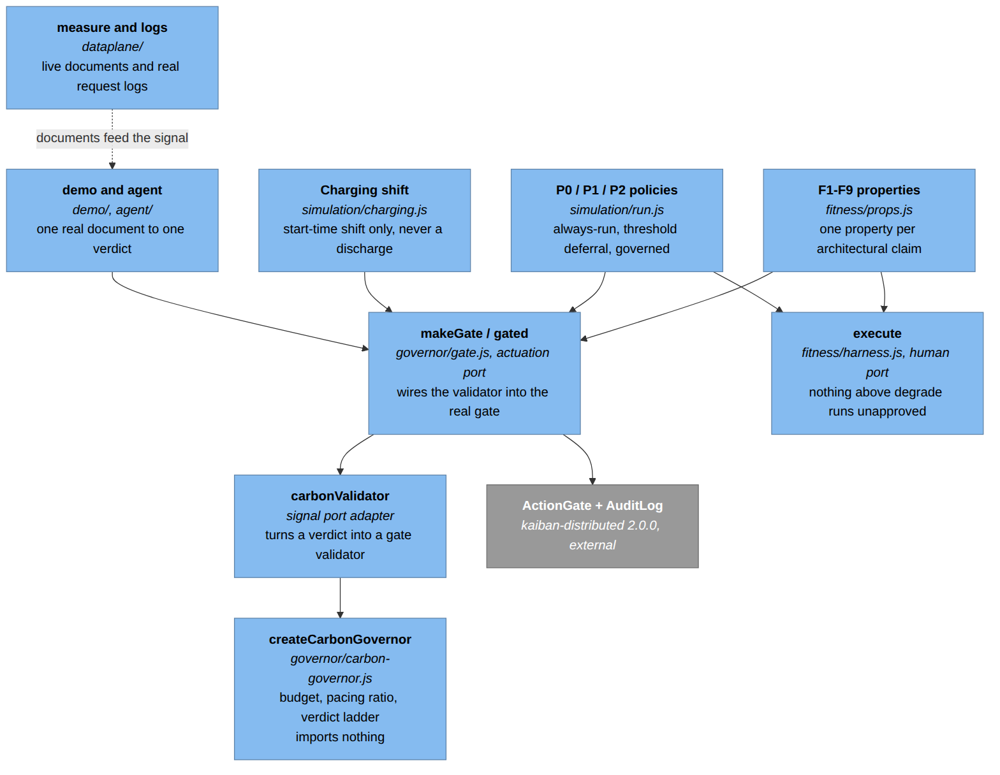
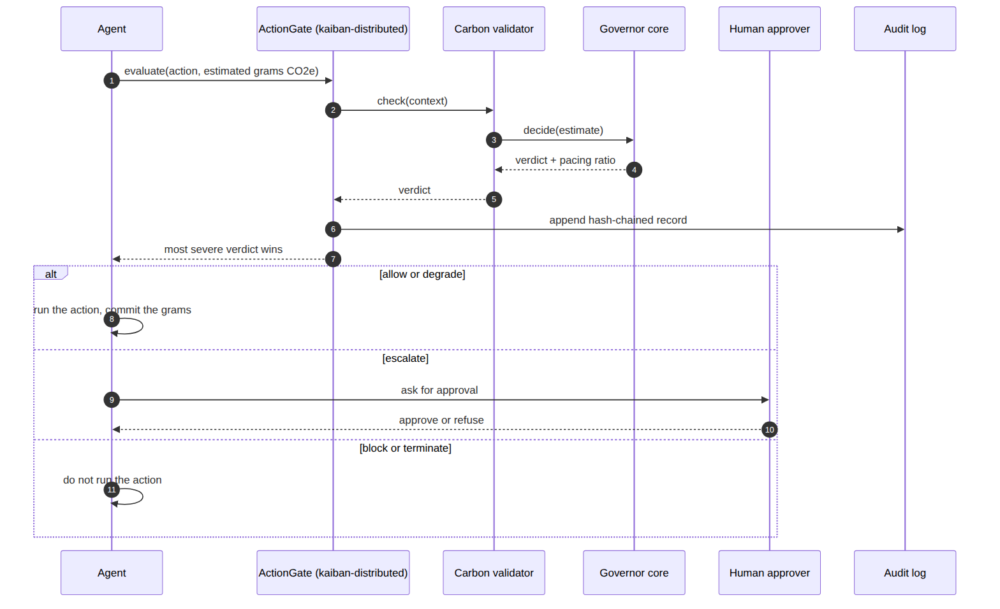
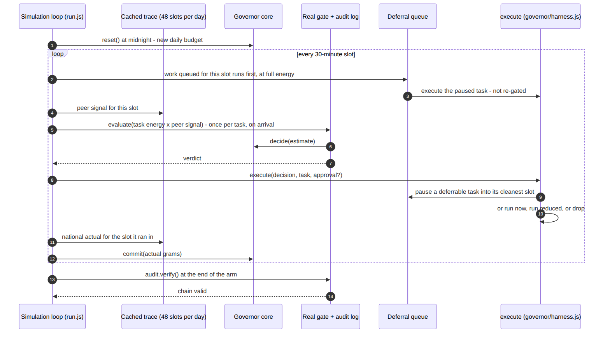

# Architecture of `sustainability-loop-eval` (arc42)

This is the architecture document for the open evaluation and replication package
of the article *The Cybernetic Sustainability Loop: Governed Agentic Systems on a
Sustainability Data Plane* (Andrei N. Besleaga, 2026).

It follows the arc42 template: twelve short sections, in the usual order. Plain
words throughout. Where a number appears, it comes from a file in `results/`.

**Honest framing, stated once and meant everywhere below.** This package is a
*reference architecture* plus an *early evaluation*. Nothing here is running in
production for anyone. The carbon governor is a reference implementation, not a
shipped product feature. The work is in progress.

---

## 1. Introduction and goals

### What the package is for

The article describes a feedback loop: systems publish their own sustainability
figures at a standard web address, other systems read those figures, an agent
turns them into a decision, and one gate decides whether the action runs, runs
smaller, waits for a person, or does not run at all.

This repository is the evidence for that description. It answers three questions
with runnable code:

| Question | How it is answered | Where |
|---|---|---|
| Does the architecture hold the properties it claims? | Twelve executable checks against the shipped gate | `fitness/`, [`results/fitness.md`](../../results/fitness.md) |
| Is the published data usable as a control signal? | Live measurement of every document on a public gateway | `dataplane/`, [`results/dataplane.md`](../../results/dataplane.md) |
| What does the governor do on real grid conditions? | Replay on real half-hourly grid-carbon traces | `simulation/`, [`results/simulation.md`](../../results/simulation.md), [`results/charging.md`](../../results/charging.md) |

### Quality goals

In priority order. When two of these pull against each other, the higher one wins.

| # | Goal | What it means here |
|---|---|---|
| 1 | **Honesty and traceability** | Every claim points at a file. Every number is produced by a script and written to `results/`. Real, reference, and synthetic parts are labelled everywhere, including inside the result files. |
| 2 | **Simplicity** | A reader should be able to check the core by reading it. The governor core is 104 lines (57 of them code) and imports nothing. No framework, no build step, no clever code. |
| 3 | **Determinism** | Same inputs, same outputs, byte for byte. Fixed past time windows, seeded random numbers, an injected clock, cached traces. |
| 4 | **Fail-closed safety** | A broken validator or a nonsense input resolves to `block`, never to `allow`. |
| 5 | **Human in the loop** | Nothing above `degrade` runs without an explicit human approval reaching the point where the action would actually happen — and `terminate` does not run even with one. |
| 6 | **Portability of the core** | The governor knows nothing about HTTP, charging protocols or approval boards. Swap every adapter and the core is unchanged. |

### Who reads this

Software architects and engineers evaluating the design; reviewers of the
article; anyone who wants to re-run the numbers or extend the package.

---

## 2. Constraints

| Constraint | Why | Consequence |
|---|---|---|
| **Plain JavaScript, ES modules, Node 22.9 or newer** | A reader should not need a toolchain to check the code | No TypeScript, no transpiler, no bundler, no test framework beyond Node's built-in `node:test`. 22.9 is the floor because the scripts use `--env-file-if-exists`. |
| **Exactly one runtime dependency** | The one dependency is the thing under test: `kaiban-distributed@2.0.0`, which ships the real action gate and audit log | Nothing else may be added to `dependencies`. Everything else is a Node built-in. |
| **No wall-clock read may affect a conclusion** | Determinism | Time windows are fixed past dates; the gate is given an injected clock; freshness in the data-plane run is measured against a fixed reference date, not "now". One documented exception: `fetchedAt` in the live data-plane run is a real wall-clock read, because it records when a live fetch happened (ADR-007). |
| **Carbon data is CC BY 4.0** | The grid traces come from the National Energy System Operator's Carbon Intensity API | The attribution must appear in the repository and in anything derived from the data |
| **No claim of a deployment that does not exist** | Honesty | The gateway is the author's own reference deployment. No third party publishes into it. The wording never implies otherwise. |
| **The charging scenario may only shift start times** | The underlying demand-shaping mechanism is the subject of a patent application on which the author is a co-inventor; this work sits strictly above it | `simulation/charging.js` contains no discharge, no vehicle-to-grid, and no state-of-charge logic. Every vehicle always gets its full charge before its deadline. |
| **Files stay small and single-purpose** | Readability | Roughly 150 lines is the target. Four files are above it with a written reason (`fitness/props.js`, `simulation/run.js`, `simulation/charging.js`, `dataplane/measure.js`); the list and the reasons are in ADR-001, and nothing else may cross it without joining that list. |

---

## 3. Context and scope

### What is inside this repository

- The **Carbon-Verdict Governor** reference core and the adapter that plugs it into the real gate (`governor/`).
- Twelve **architecture fitness functions** (`fitness/`).
- **Live measurement** of the public data plane (`dataplane/`).
- **Trace-driven simulation**: an agentic workload and an EV-charging night (`simulation/`).
- A one-command **demo** and an optional **live agent run** (`demo/demo.js`, `demo/agent.js`).
- **Committed inputs and outputs** (`data/`, `results/`) so a reader can check the numbers without running anything.
- **Shared leaf utilities** (`shared/`): the seeded generator and one definition of median, p95 and standard deviation for the whole package.

### What is outside, and how this package touches it

| Outside system | What it is | How this package uses it |
|---|---|---|
| **The IETF Internet-Draft** | Defines the well-known address `/.well-known/sustainability-data` and the document format: 8 mandatory members, 16 optional | The data-plane measurement checks live documents against those member lists |
| **The reference gateway** | A public deployment serving conformant documents, operated by the article's author | Read over HTTP. Not part of this repository. |
| **`kaiban-distributed`** | An open-source distributed agent runtime. It ships the `ActionGate` and the hash-chained `AuditLog`. | Imported from npm at version 2.0.0 and used as the real enforcement point. Not mocked. |
| **NESO Carbon Intensity API** | Real half-hourly carbon intensity for Great Britain, free and keyless, CC BY 4.0 | Fetched once by `simulation/fetch-traces.js`, then cached under `data/simulation/` |
| **MCP servers for charging protocols** | Separate open-source prototypes exposing live charging operations as typed tools | **Not evaluated here.** The charging scenario is a simulation through the governor and the gate, not a live protocol call. Listed in [`docs/ARTIFACT-INVENTORY.md`](../ARTIFACT-INVENTORY.md). |
| **The OpenRouter API** | Used only by the optional live agent run | `demo/agent.js` asks a real model (`anthropic/claude-sonnet-5` by default) to propose a task; the proposal then goes through the same real gate |

### The larger system versus this package

The article's loop is bigger than this repository. The repository holds the
*decision* half of the loop and the *measurement* of the signal half. The
publishing half lives in separate packages and in the gateway; the physical
actuation half lives in separate prototype tool servers. This document is
careful about that line, and section 11 lists what it means for the results.

---

**Outside the repo, above the loop:** the article's normative criteria (the author's Sustainability-First Consensus framework, Communications of the ACM, in press) decide what a budget should be; this package takes a budget as an input and evaluates what the loop does with it.

## 4. Solution strategy

Six decisions carry the whole design.

1. **A hexagonal core with adapters at the edges.** The governor owns four ports:
   a *signal port* (peer and grid readings come in), a *forecast port* (load and
   generation forecasts), a *human port* (approvals), and an *actuation port*
   (decisions go out). Everything concrete — an HTTP client, a charging protocol,
   an approval board — is an adapter behind one of those ports. The core file
   imports nothing at all, and a fitness function checks that statically.

   Three of those four ports have an adapter here. **The forecast port is
   designed, not built**: the simulations read the peer signal straight out of
   the cached trace, so there is no file to point at for it.

2. **One gate, one total order.** Every carbon-relevant decision goes through a
   single gate that aggregates all validator opinions to the most severe verdict
   on the ladder `allow < degrade < escalate < block < terminate`. Scattered
   per-component policies cannot aggregate and cannot fail closed; one ordered
   ladder can.

3. **The gate is the shipped one, not a copy.** The package imports
   `kaiban-distributed@2.0.0` and calls its real `ActionGate` in-process, backed
   by its real hash-chained `AuditLog`. Testing a reimplementation would prove
   nothing about the runtime.

4. **Evaluation on three legs.** Fitness functions test properties. Live
   measurement tests whether the signal exists and is usable. Simulation tests
   what the policy does under real grid conditions. No single leg would be
   convincing alone.

5. **Everything reproducible and committed.** Inputs are cached under `data/`,
   outputs are committed under `results/`, and every script is deterministic
   except the live network measurement, whose only unstable numbers are
   latencies and the `fetchedAt` stamp.

6. **One actuation path.** `governor/harness.js` is the only code in this package
   that turns a verdict into something running. Every adapter — both simulations
   and both demos — calls it. A fitness rule checks that each actuating adapter
   really imports it, so the human-in-the-loop guarantee cannot be reached around.

---

## 5. Building block view

### Level 1 — the package

| Folder | Responsibility |
|---|---|
| `governor/` | The reference core, its gate adapter, and the actuation harness. The only part that is architecture rather than evaluation. |
| `fitness/` | Twelve executable checks of architectural properties, and the code that renders them into `results/fitness.md`. |
| `shared/` | Leaf utilities used by everything: the seeded generator and one definition of median, p95 and standard deviation. Imports nothing but Node built-ins. |
| `simulation/` | Two trace-driven experiments and their shared plumbing. |
| `dataplane/` | Live measurement of the public gateway and analysis of its real request logs. |
| `demo/` | Two one-command walkthroughs: `demo.js` (one real document, one decision, five verdicts) and `agent.js` (the same with a real language model proposing and a real person on the human port). |
| `data/` | Cached inputs: grid traces, fetched documents, raw request logs. |
| `tools/` | `check-numbers.js`, which re-reads every hand-typed headline number in the docs against `results/`. |
| `results/` | Committed outputs: one JSON and one short Markdown reading per experiment. |
| `docs/` | This document, the product spec, the decision records, the fitness-function rationale, the search protocol, the artifact inventory. |

### Level 2 — key modules

| Module | Responsibility | Notes |
|---|---|---|
| `governor/carbon-governor.js` | Holds a carbon budget in grams CO2e, tracks what has been spent, turns a *committed / budget* ratio into a verdict, and exposes the reference aggregation rule `mostSevere()` | 104 lines. Imports nothing. `decide()` has no side effects; `commit()` is the only thing that moves state, and it throws on a non-finite or negative value rather than committing a silent zero. |
| `governor/harness.js` | The human port, and the only path in the package from a verdict to actually running something | Imports nothing. `allow` and `degrade` run automatically; `escalate` and `block` need an approval whose `approved` field is exactly `true`; `terminate` never runs. |
| `governor/gate.js` | Builds the real `ActionGate` with the governor registered as a validator and a real `AuditLog` behind it; gives it a deterministic injected clock. `gated()` normalises any verdict that is not on the ladder to `block`, keeping the original under `rawAction`; `chainAnchor()` and `verifyAnchored()` live here too | Imports two things plus one Node built-in: `kaiban-distributed`, the core, and `node:crypto` (for the anchor digest) |
| `fitness/props.js` | The thirteen properties F1–F13, each an exported function returning `{ id, property, cases, passed, notes }` | The property logic lives here once; the test files and the report both call it. Above the size target on purpose — see ADR-001. |
| `fitness/fN.test.js` | One `node:test` file per property, asserting on `passed` | Twelve files, about 15 lines each |
| `fitness/import-graph.js` | Parses every source file's import statements into the real import graph that F7 checks | A per-statement scanner, not a regex over the whole file |
| `fitness/report.js` | Runs the same thirteen properties and writes both `results/fitness.json` and `results/fitness.md` | No duplicated logic, and no hand-written result file |
| `shared/prng.js`, `shared/stats.js` | Seeded random numbers (mulberry32) and one definition of median/p95/sd for the whole package | So property cases are reproducible and every "p95" means the same thing. A leaf: nothing in `shared/` imports anything from the package. |
| `tools/check-numbers.js` | Re-reads every hand-typed headline number in `README.md` and the docs and compares it with `results/*.json` | Registered as fitness function F12; part of `npm test` |
| `simulation/fetch-traces.js` | Fetches and caches the real grid traces onto a canonical half-hourly grid | The only script in `simulation/` that touches the network |
| `simulation/lib.js` | Trace loading, the canonical slot grid, and the synthetic workload generator with all its knobs in one object | Draws its randomness and its statistics from `shared/`; it does not define its own |
| `simulation/run.js` | Experiment E2: the policies over the same task list — always-run, threshold deferral (whole-window and trailing-median variants), and the governor at five budget levels | |
| `simulation/charging.js` | Experiment E3: a fleet of EVs shifting charge start times under the gate and an owner approval | Start times only, by construction |
| `simulation/report.js` | Renders the Markdown readings for E2 and E3. Recomputes nothing. | |
| `simulation/lib.test.js`, `simulation/policies.test.js` | Unit tests for the trace and workload plumbing, and for the rung semantics of the two policies | Part of `npm test`; not fitness functions |
| `dataplane/measure.js` | Fetches every document the gateway serves, five times each, and checks members, schema, disclaimers, size, latency and freshness | Live network. The only adapter allowed one external import: the optional reference consumer library (ADR-017). |
| `dataplane/doc-check.js` | The member, disclaimer and freshness checks for one document, separated from the fetching | Pure; no network |
| `dataplane/logs.js` | Reads the already-pulled raw request log file and counts what it contains | Does not shell out to anything. Hashes client IPs on ingest. |
| `dataplane/report.js` | Renders `results/dataplane.md` from the JSON. Recomputes nothing. | |
| `dataplane/measure.test.js` | Unit tests for the document checks | Part of `npm test`; not a fitness function |
| `demo/meaning.js` | The one MEANING table both demos print, in the wording of section 8 | So the two demos cannot describe a rung differently |

---

## 6. Runtime view

### 6.1 One governed decision through the real gate

An agent is about to do something that will emit carbon. It hands the gate an
estimate in grams. The gate runs every validator it has, one of which is the
carbon validator wrapping the governor. The governor adds the estimate to what it
has already spent, divides by the budget, and reads the ratio off the ladder. The
gate takes the most severe verdict any validator returned, writes a hash-chained
audit record, and returns it. Then:

- `allow` — the action runs as proposed, and the actual grams are committed to the budget.
- `degrade` — the action runs smaller. Work that can wait is *deferred* instead: paused now, run at full energy later, in the cleanest slot the peer signal predicts before its deadline (ADR-016).
- `escalate` — a human is asked. On approval the action does the same physical thing as `degrade` — defer, or run reduced. Without approval nothing runs.
- `block` — the action as proposed does not run. A human may authorise the reduced or deferred fallback, and nothing else. Without that approval nothing runs.
- `terminate` — nothing runs, and no human is asked. It is not overridable.

Section 8 gives the same five rungs as one table, per adapter.

### 6.2 One simulated day

`simulation/run.js` walks a 28-day window in 30-minute slots. At each midnight the
budget resets. In each slot, work queued for that slot runs first and commits its
real emissions; then newly arrived tasks each become a gated action. The estimate
the agent sends is *what a peer's published document would tell it* — the peer
signal — while the emissions actually charged come from the national actual
series. That difference is deliberate: it is the honest gap between what an agent
can see and what really happened. At the end of the run the audit chain is
verified.

### 6.3 One charging night

`simulation/charging.js` runs the same window as nights. Fifty vehicles plug in
around 18:00 and must be full by 07:00. For each vehicle the agent finds the
cleanest three-hour window the peer signal predicts, and asks the gate about
moving the charge there. If the gate says `allow`, `degrade` or `escalate`, the
owner is asked; if the owner agrees, the charge is moved. Asking the owner even on
`allow` is a *product* rule, not a gate rule: it is somebody's car. If the gate
says `block` or `terminate`, the shift is refused outright with no fallback and no
one asked, and the car charges the moment it was plugged in. It charges either
way. What is withheld is the improvement, never the electricity.

### 6.4 One data-plane measurement

`dataplane/measure.js` reads the gateway's index, then fetches every subject
document plus the gateway's own document five times each. For each document it
records status, latency and size, checks the mandatory and optional members
against the draft, validates against the schema using the reference consumer
library, looks for the in-band not-endorsed disclaimer, and computes freshness
against a fixed reference date. Then `dataplane/logs.js` reads the raw request-log
file that was pulled separately and summarises the real traffic the gateway served.

### 6.5 The demo, and the live agent run

`npm run demo` fetches one real document from the public gateway, turns its
carbon-intensity figure into an estimate for one action, sends that action through
the real gate, and prints the verdicts. If the network is unavailable it falls
back to a committed fixture and says so. It prints one action per rung, so all
five verdicts and their meanings appear in one screen. `npm run agent` does the
same with a real language model proposing the action; when the verdict is
`escalate` it asks *you*, at the terminal, to approve, and when the verdict is
`block` it asks whether you authorise the reduced fallback instead. On `terminate`
it asks nothing. It needs an API key; without one it explains that and exits.
Neither command produces a number that appears anywhere in `results/`.

---

## 7. Deployment view

There is one deployment: a developer's machine.

| Thing | Requirement |
|---|---|
| Runtime | Node.js 22.9 or newer (`--env-file-if-exists`, used by `npm run agent`, arrived in 22.9) |
| Install | `npm install` — one runtime dependency |
| Disk | The cached traces and documents are already committed; nothing large is downloaded |
| Operating system | Anything Node runs on |

### What touches the network

| Command | Network | Notes |
|---|---|---|
| `npm run fitness` / `npm test` | none | Pure in-process |
| `npm run check:docs` | none | Re-reads the docs against `results/` |
| `npm run simulate`, `npm run charging` | none | Read the cached traces |
| `npm run fetch-traces` | NESO Carbon Intensity API | Run once; keyless |
| `npm run dataplane` | the public gateway | Live; latency numbers will differ per run |
| `npm run demo` | one document from the gateway | Falls back to a committed fixture offline |
| `npm run agent` | the gateway and the OpenRouter API | Needs `OPENROUTER_API_KEY` (in `.env`, gitignored) |
| `npm run arch` | none | Checks for circular imports with `madge` |
| `npm run arch:graph` | none | Draws the whole import graph with `madge` — this is what produced `results/madge.txt` |

No server is deployed by this package. No broker, no database, no container. The
gate's semantics do not depend on any of that — it is in-process code — which is
why a full `kaiban-distributed` deployment is not needed to evaluate it.

---

## 8. Cross-cutting concepts

### The verdict ladder is a total order

`allow < degrade < escalate < block < terminate`. Because the order is total, any
set of validator opinions has exactly one most severe member, so concurrent
policies always aggregate to a single answer. Fitness functions F1 and F9 check
that the shipped gate really computes that maximum and that the package's
reference rule computes the same thing.

### Stopped, refused and paused are three different things

`terminate` is **stopped**: it does not happen and nobody can make it happen.
`block` is **refused**: what was proposed does not happen, but a person may
authorise a smaller or later version. A deferred task is **paused**: authorised,
not refused, not stopped, just waiting for a cleaner slot.

This is the canonical table. ADR-006, `PRODUCT.md` UC-4, `demo/meaning.js` and the
README's plain-words version all point at it rather than restating it.

| Rung | Who authorises | Core rule (`governor/harness.js`) | E2 workload simulation (`simulation/run.js`) | E3 charging simulation (`simulation/charging.js`) | `demo/agent.js` |
|---|---|---|---|---|---|
| `allow` | automatic | runs | runs now, at full energy | shift proposed; the owner's consent is still required (a product rule, not a gate rule) | "would run" |
| `degrade` | automatic | runs in reduced form | **non-deferrable:** runs now at `degradedFraction`. **deferrable:** deferred — paused, and later run at full energy in the cleanest slot the peer signal predicts before its deadline | shift proposed; owner consent | "would run, reduced" |
| `escalate` | a human decides | runs only with `approval.approved === true` | a human is asked; on approval the task does the same physical thing as `degrade` (defer, or run reduced). Counted as **1 human decision** | shift proposed; owner consent | prompts y/n; runs as proposed on y |
| `block` | withheld; a human **may** authorise a reduced or deferred fallback | runs only with `approval.approved === true`, and then only the fallback | a human is asked whether to authorise the fallback; on approval the task does the same physical thing as `degrade`. Counted as **1 human decision** | refused outright, no fallback — the car charges exactly as it would have without the agent | prompts: authorise a REDUCED run (`degradedFraction`) y/n; nothing else is offered |
| `terminate` | nobody — not overridable | never runs; no human is asked | task dropped | refused | "stopped — nothing runs" |

Three things follow:

- **Human decisions = every `escalate` verdict + every `block` verdict** in E2 — what `humanDecisions` counts, and what the article's "19 and 30 escalate-or-block cases per day" means. `blocksDeferrable` and `humanDecisionsIfDeferralAutomatic` report the sensitivity: 442.9 (winter) and 637 (summer) over 28 days — about 16 and 23 a day — against 545.7 and 853 when every block is approved; the difference is the 102.8 and 216 block verdicts on deferrable work.
- **A deferred task is gated exactly once**, on arrival. One task, one verdict, one audit record (ADR-016).
- **`block` in E3 has no fallback.** A car is not a task you can run at 40%; the refusal falls back to charging naively.

### What is upstream's and what is this package's

`kaiban-distributed@2.0.0` ships the aggregation rule (most-severe-wins), the
fail-closed behaviour on a validator error, the hash-chained audit log, and the
registry kill-switch. It does **not** ship the meaning of the rungs: its default
actor path treats `allow` and `degrade` as "proceed" and sends `escalate`, `block`
and `terminate` alike to a dead letter, with no human-approval port. The semantics
above are this package's.

So F1, F2, F5, F6, F8 and F9 test shipped code; F3 and F4 test this package's
semantics; F7, F10, F11 and F12 test this repository's structure and honesty. A
green table is not a claim that the runtime guarantees the human-in-the-loop part.

Upstream's `WorkflowOrchestrator` / `CheckpointStore` (Redis) do
checkpoint-and-resume for crash recovery — the natural home for a production
"pause and rehydrate" of a deferred task, but unrelated to governance and not used
here.

### The ladder is driven by a pacing ratio

The governor computes `(already spent + this action's estimate) / budget` and
reads the verdict off fixed rungs: `degrade` at 0.8, `escalate` at 1.0, `block` at
1.1, `terminate` at 1.25. This paces spending rather than capping it: `degrade`
fires well before the budget is used up, and work that is deferred across midnight
commits against the next day's budget. Section 11 says plainly what that costs.

### Fail-closed

A validator that throws, and an estimate that is not a finite non-negative number,
both resolve to `block`. There is exactly one legitimate bypass: a gate configured
with `enabled: false` allows everything and records nothing. That is a
deployment-time, all-or-nothing switch, not a per-request escape hatch, and F2
checks both halves of that statement.

### The audit chain

Every decision the gate makes is appended to a hash-chained log. `verify()`
recomputes the chain; changing one field of one record makes `verify()` fail and
name the index where it broke. F6 checks both. Every simulation arm verifies its
chain at the end and records the result.

What that does and does not buy, because "tamper-proof" would be too strong:

- **Edits are detected** by `verify()`, which names the index (F6, F10).
- **Truncation is not**, by `verify()` alone — a shortened chain is still consistent. F10 asserts that honestly.
- **Truncation is detected with an anchor**: `chainAnchor(records)` returns `{ length, tipHash, anchorHash }` (the third is a digest of the first two, so a corrupted anchor object is itself noticed), and `verifyAnchored(audit, anchor)` compares against one taken earlier (F10). An anchor protects only the records up to its position; a tail rewritten after it passes both checks.
- **The log is tamper-*evident*, not tamper-*resistant*.** `records()` returns live objects, so code in the process can mutate them; `verify()` will notice, but nothing prevents it. Not persisted, not signed (section 11).

### Determinism

Nothing that affects a result reads the wall clock, calls the network at run time,
or uses unseeded randomness. Random draws come from a seeded mulberry32 generator.
The gate is given an injected clock that counts synthetic seconds. Time windows
are fixed dates in the past. Freshness in the data-plane run is measured against a
fixed reference date. F8 checks that two fresh gates given the same inputs produce
byte-identical decisions *and* byte-identical audit records.

### The human port

`governor/harness.js` is the only path in this package from a verdict to running
something. `allow` and `degrade` run on their own. `escalate` and `block` run only
if an approval object is present and its `approved` field is exactly `true`.
`terminate` never runs, approval or not.

The harness imports nothing, so no adapter can reach around it by importing
something cleverer. F7 additionally requires that every adapter which actuates —
`simulation/run.js`, `simulation/charging.js`, `demo/demo.js`, `demo/agent.js` —
really imports it. F4 checks the rule over random decisions, F5 asserts
`executed === (autoRun || approved)` per case, and `simulation/policies.test.js`
asserts that `terminate` does not run even when handed an approved approval.

The simulations use simulated approvers, which is a real limitation and is named
as such in section 11.

### Provenance labels

Three words are used consistently, in the docs and inside the result files:

- **Real** — the shipped gate and audit log; the live gateway documents; the real request logs; the grid-carbon traces.
- **Reference** — the Carbon-Verdict Governor core: the article's specification made executable, evaluated here, and *not* merged into any released runtime.
- **Synthetic** — the agentic workload, the EV fleet, the simulated human approvers. Also the two `*.example` subjects on the gateway, which are labelled synthetic there too.

One extra label matters: the three "peer" series in the simulation are the grid
API's *regional forecasts* standing in for peers' published documents. They are
real data used as a stand-in, not real peer publications.

---

### A control-theoretic reading

The article's title says *cybernetic*; this is what kind of controller the package
actually contains, in control-theory terms, so a reader with that background does not
have to reverse-engineer it.

- **Two loops, one closed.** The inner budget loop is a genuine negative-feedback
  regulator: `commit()` feeds back the *measured* grams (the national actual), not the
  estimate the decision was made on, so the estimate/actual gap is inside the loop and
  the integrator corrects it. The outer loop — act → publish → peers sense → act — is
  open in every experiment: the signal is an exogenous cached trace (R12).
- **What the governor is.** Integral control on its own cumulative spend (the pacing
  ratio), a quantised five-level output (the ladder), a hard reset every period, and
  pure feedforward with respect to the grid — it reads a forecast and never senses the
  grid's response to its own actions. "Paces, does not cap" (R3) and the midnight
  sawtooth (R16) are the signatures of the reset-plus-carry-over coupling. It is closer
  to a token-bucket pacer than to Watt's proportional governor the name evokes.
- **Requisite variety (Ashby).** A five-state controller regulates disturbances of far
  higher variety. ADR-004's choice of a ladder over a continuous throttle is a deliberate
  variety *attenuation*: regulation resolution is traded for a total order, which is
  what lets concurrent opinions aggregate and the gate fail closed.
- **The good-regulator theorem (Conant and Ashby).** Every good regulator of a system
  must be a model of that system. The governor contains no model of workload or grid;
  the forecast port, where that model would live, is designed and not built. It is
  therefore not an optional adapter but the precondition for the governor being a
  *good* regulator rather than a reflexive one.
- **Beer's Viable System Model.** System 1 = the actuating adapters; System 2 = the
  gate's total-order aggregation (anti-oscillation between S1 units, Beer's S2 role);
  System 3 = the budget bargain, with the hash-chained audit log as the S3\* audit
  channel; System 4 = the forecast port — the outside-and-future function, missing, which
  VSM predicts as the failure mode of a merely reactive organisation; System 5 = the
  normative layer, correctly outside this package. `escalate`/`block` through the human
  port are the algedonic channel; `terminate` is the algedonic stop.
- **Where the dynamics are not analysed.** Stability, delay and synchronisation of many
  controllers on one shared signal (R11), and the strategic dynamics of a self-declared
  control input (R15).

## 9. Architecture decisions

Eighteen decisions are recorded in [`docs/adr/`](../adr/). Each one is short:
context, decision, consequences, alternatives considered.

| ADR | Decision |
|---|---|
| [ADR-001](../adr/ADR-001-plain-javascript-esm.md) | Plain JavaScript ES modules, zero framework |
| [ADR-002](../adr/ADR-002-real-gate-not-a-mock.md) | The real `kaiban-distributed` ActionGate is the enforcement point |
| [ADR-003](../adr/ADR-003-core-imports-nothing.md) | The governor core imports nothing |
| [ADR-004](../adr/ADR-004-five-rung-ladder-and-rungs.md) | A five-rung ladder driven by a pacing ratio, rungs 0.8 / 1.0 / 1.1 / 1.25 |
| [ADR-005](../adr/ADR-005-fail-closed.md) | Fail closed on bad input and on validator errors |
| [ADR-006](../adr/ADR-006-human-port-and-stop-rungs.md) | Escalation and block go to the human port; terminate is never overridable; the harness is the only actuation path |
| [ADR-007](../adr/ADR-007-determinism.md) | Determinism by construction |
| [ADR-008](../adr/ADR-008-real-grid-traces.md) | Real NESO traces: national actual for emissions, regional forecasts as peer stand-ins |
| [ADR-009](../adr/ADR-009-synthetic-workload-parameters.md) | Synthetic workload parameters live at the top of their file |
| [ADR-010](../adr/ADR-010-threshold-deferral-baseline.md) | Threshold deferral is the simple baseline |
| [ADR-011](../adr/ADR-011-charging-start-time-shift-only.md) | The charging scenario shifts start times only |
| [ADR-012](../adr/ADR-012-commit-results-and-data.md) | Results and cached data are committed on purpose |
| [ADR-013](../adr/ADR-013-fitness-functions-as-test-layer.md) | Fitness functions are the architecture test layer |
| [ADR-014](../adr/ADR-014-demo-live-document-with-fixture-fallback.md) | The demo reads one live document, with a fixture fallback |
| [ADR-015](../adr/ADR-015-cc-by-attribution.md) | CC BY 4.0 attribution for the grid data |
| [ADR-016](../adr/ADR-016-gate-once-on-arrival-execute-later.md) | Gate once on arrival, execute later: the deferral queue |
| [ADR-017](../adr/ADR-017-consumer-library-optional.md) | The reference consumer library is resolved at run time; its absence is reported as "not measured" |
| [ADR-018](../adr/ADR-018-openrouter-for-the-agent-demo.md) | The optional agent demo calls OpenRouter over plain HTTPS, defaulting to `anthropic/claude-sonnet-5` |

---

## 10. Quality requirements

Each quality goal from section 1, as a scenario that a script can settle.

| # | Goal | Scenario | Settled by | Status |
|---|---|---|---|---|
| Q1 | Fail-closed safety | A validator throws, the carbon estimate is `NaN`, negative, missing or a string, or a validator returns a verdict that is not on the ladder | F2, 100 cases | Green — [`results/fitness.md`](../../results/fitness.md) |
| Q2 | Fail-closed safety | Two validators disagree; one wants `allow`, one wants `terminate` | F1 and F9, 4,000 cases | Green |
| Q3 | Predictability | Budget pressure rises step by step; severity must never fall | F3, plus the four default rung boundaries pinned exactly | Green |
| Q4 | Human in the loop | A verdict of `escalate`, `block` or `terminate` arrives with no approval, or with a refusal; and `terminate` arrives *with* an approval | F4 and F5, 4,100 cases, plus `simulation/policies.test.js` | **Green (the harness is the actuation path used by every adapter as of v1.1.0)** — before v1.1.0 the harness was the tested path but not provably the only one, because nothing checked that the adapters went through it |
| Q5 | Nothing runs unaudited | Actions of every operation type the gate defines are evaluated; the audit length must equal executed plus refused | F5, 2,100 cases | Green |
| Q6 | Evidence integrity | One field of one audit record is changed after the fact; and the tail of the chain is truncated | F6 plus F10, 800 cases. `verify()` must fail at the edited index; truncation is caught by `verifyAnchored()` and, honestly recorded, **not** by `verify()` alone | Green |
| Q7 | Portability of the core | Static check of the import graph: `governor/carbon-governor.js` and `governor/harness.js` import nothing, the gate adapter imports only the runtime and the core, adapters do not import each other, every actuating adapter imports the harness, and the one external-library exception is named | F7, 30 checks | Green |
| Q8 | Determinism | The same estimate sequence through two fresh gates | F8, 300 steps; decisions and audit records must be byte-identical | Green |
| Q9 | Traceability | Every number in the article can be pointed at a file in `results/`, and every hand-typed number in the docs still matches it | F12 (`tools/check-numbers.js`), plus the inventory in [`docs/ARTIFACT-INVENTORY.md`](../ARTIFACT-INVENTORY.md) for artifacts the scripts do not measure | Green for the numbers a script produces; the inventory is still maintained by hand |
| Q10 | Simplicity | The governor core stays readable in one sitting | 104 lines, of which 57 are code and the rest are comments and blanks; zero imports; F7 keeps it that way and F12 keeps this row honest | Green |

All thirteen fitness functions pass, over 14,966 cases in total. Version 1.0.0
— the snapshot the article cites — had nine, over 10,994 cases; the difference is
properties added, not properties fixed. The same gate and audit code carries its
own upstream governance suite (4 files, 71 tests), which also passes
(`results/kaiban-upstream-tests.json`, commit `17ad362`), and an upstream
end-to-end suite of 69 tests against a real Redis broker
(`results/kaiban-upstream-e2e.json`, same commit).

---

## 11. Risks and technical debt

Written plainly, because these are the things that would change the conclusions.
R1 to R18 below are the canonical list (R11–R17 from the 2026-08-31 audit, R18 from the 2026-09-01 literature pass); [`docs/LIMITATIONS.md`](../LIMITATIONS.md)
indexes every other place in the repository where a limitation is stated, so a
reader can check that they all say the same thing.

| # | Risk | What it means | What would fix it |
|---|---|---|---|
| R1 | **The workload is synthetic** | Task arrivals, task energy, the deferrable half, and the cost of degraded mode are all stipulated numbers, not measurements. The percentages move with the workload. | Replay a real trace of a real agentic service |
| R2 | **The peer signal is biased** | The three "peers" are regional forecasts from the grid API. They track the national actual closely in *shape* (Pearson r 0.96 in winter, 0.986 in summer) but sit low in *level* — one region is near-zero-carbon all summer. An agent that used them to set an absolute budget would set it wrong. | Calibrate peer signals before using them as levels, and get real peers publishing |
| R3 | **The governor paces, it does not cap** | Days still end over budget, because deferred work commits into the next day and non-deferrable work is throttled but not stopped short of the top rung. This is a property of the design, not a bug. | Say so — the article and the result files do. A hard cap would need a different design and a different safety argument. |
| R4 | **Less emission means less work done** | The governor's savings are partly because it drops and degrades tasks. Total grams must always be read next to completed, degraded and dropped counts. | Read the tables together; never quote the emissions column alone |
| R5 | **The author measures his own gateway** | The gateway is the article author's reference deployment, and its real-organization documents are illustrative mappings prepared by the operator from public reports — not published or endorsed by those organizations. Discovery and comparability are demonstrated; third-party adoption is not. | An independent organization publishing its own document |
| R6 | **The approvers are simulated** | In the workload simulation the approver always agrees; in the charging simulation it is a seeded coin at 100% and 80%. Real human friction, latency and fatigue are untested. | A study with real approvers |
| R7 | **The MCP servers are not evaluated** | The charging scenario runs through the governor and the gate, not over a live charging protocol. The tool servers exist as separate prototypes and are inventoried, not measured. | A gated end-to-end run against a real protocol endpoint |
| R8 | **Ten seeds, two windows** | Ten seeds per configuration and two 28-day windows (one winter, one summer) in one country. The spread between seeds is reported, but this is not a wide sample. | More seeds, more windows, more regions, more countries |
| R9 | **The gate is one runtime** | The properties are checked against one implementation of the ladder, in one process. And the ladder's *meaning* — the human port, `block` as a refusal with a fallback, `terminate` as unoverridable — is this package's, not the runtime's; the runtime treats the top three rungs alike. | A second independent implementation to check against, and the semantics merged upstream |
| R10 | **The absence claims are search results** | The novelty claims rest on a documented adversarial search on a stated date. Absence of evidence in those sources, nothing more. | Documented in [`docs/SEARCH-PROTOCOL.md`](../SEARCH-PROTOCOL.md); readers are asked to open an issue if they find a prior composition |
| R11 | **Shifted load piles onto one slot** | Every deferrable task and every vehicle picks the cleanest slot of the *same* shared signal, so shifted work synchronises. Measured at f = 0.8: 75.3% (winter) and 92.9% (summer) of deferred executions land in the busiest 5% of half-hours, up to ~43 queued tasks in one slot against an arrival mean of 6; in E3 all 50 cars start in the same slot on most nights and one summer slot takes 54.8% of all sessions. The signal is exogenous here, so the pile-up cannot feed back; at adoption scale it would. Not modelled. | An endogenous-signal sensitivity arm, dispersion inside the clean window, a capacity term in the governor |
| R12 | **The two halves are joined by assumption** | No measured experiment consumes the gateway's documents as its control signal: E1 measures annual disclosures (median `updated` age 23 days, reporting-period age 233 days, 3 of 12 with a `carbon-intensity` member) while E2/E3 consume a half-hourly stand-in. The publish-back edge of the loop is never exercised. | Peers publishing at grid cadence; an E2 arm fed from real gateway documents |
| R13 | **In E3 the gate can only reduce the saving** | `allow`/`degrade`/`escalate` all yield the same shift and `block`/`terminate` fall back to naive charging, so the saving is the scheduler's. Measured: an ungated argmin-only arm avoids 32.85% / 16.53% against the governed 32.51% / 16.04%. The gate adds audit, pacing and the human port there, not grams. | **Done:** the ungated arm is reported (`argmin_ungated`). Open: give `degrade` a distinct physical meaning in E3 |
| R14 | **Rebound unmodelled; budgets relative** | No induced demand (Jevons); every budget is f × the median of the same workload's own uncontrolled day — an oracle — not an absolute allocation. | Elastic demand in the workload model; a normative layer setting absolute budgets |
| R15 | **Self-declared estimates, no metering port** | The validator reads the agent's own `estimatedGramsCO2e`; under-declaring is allowed. No port supplies the trusted actual grams `commit()` needs (the traces do, here). Publishing a control input is strategic (Goodhart). | A metering port; attestation on published documents |
| R16 | **Arrival hour decides the verdict** | Daily reset + growing pacing ratio: 00:00–06:00 arrivals 100% allowed, 23:00 arrivals dropped 11.4% (winter) / 23.8% (summer) at f = 0.8; 35.7% / 51.2% of deferred work crosses midnight, 4.4% / 6.4% of grams are yesterday's. No fairness cut reported. | A rolling budget window; a fairness column |
| R17 | **Average intensity, not marginal** | Attributional accounting (energy × slot average); shifted load is often served by the marginal plant, so real abatement can be smaller. Traces are CO2-only, labelled gCO2e (ADR-015). | Re-score with a marginal series; state both |
| R18 | **No randomised delay in E3** | `bestStart()` is a deterministic argmin, so every vehicle picks the same clean window. SI 2021/1467 reg. 11 requires a random delay up to 600 s (capability 1800 s) on every GB charge point, precisely to prevent coincident switching. The modelled fleet could not lawfully operate; expected effect on the numbers is small at 30-minute resolution. | Randomised-delay arm; state the gap wherever E3 is described |

### Technical debt

Fixed in v1.1.0, recorded because the v1.0.0 archive still has them: the
data-plane run's absolute-path import of the consumer library (ADR-017); no single
command that rebuilt everything (`npm run all`, plus F12); a hand-written
`results/fitness.md`; client IP addresses in the raw request log, now stored only
as a salted hash whose salt is discarded.

Still open:

- **The shipped gate passes a non-ladder action through verbatim** instead of failing closed on it. `gated()` normalises it to `block` and keeps the original under `rawAction`, so nothing downstream sees it — but the gap is upstream's, and is to be reported there.
- **The audit log is tamper-evident, not tamper-resistant**, in memory, not persisted and not signed. `verify()` catches an edit and `verifyAnchored()` catches a truncation; nothing prevents either.
- **`fetchedAt` is a real wall-clock read** — the honest exception to determinism (ADR-007), which is why `results/dataplane.json` never diffs clean.
- **The forecast port is designed, not built**, and so is the wiring from the human port to a real approval board.
- **`data/dataplane/` is a snapshot** that re-running overwrites.
- **The deferral queue is in memory** for one simulated arm; nothing is persisted (ADR-016).

---

## 12. Glossary

| Term | Plain meaning |
|---|---|
| **Adapter** | A piece of code that plugs a concrete outside system into a port. Swap the adapter, the core is unchanged. |
| **`allow`** | Lowest rung. Runs as proposed, automatically. |
| **Arm** | One run of one policy, at one setting, with one seed, over one window. A result row is the mean of ten arms. |
| **Action gate** | The single place every consequential action must pass through. It collects validator opinions, picks the most severe, records the decision, and returns it. |
| **Audit chain** | An append-only log where each record's hash covers the previous one. An edit breaks it visibly; a truncation does not, without an anchor. |
| **`block`** | Fourth rung. Refused: a human may authorise the reduced or deferred fallback and nothing else. |
| **Budget factor (f)** | The daily budget as a multiple of the median uncontrolled day: `f = 1.0` is the loosest setting evaluated, `f = 0.6` the tightest. |
| **Carbon budget** | An allowance of grams of CO2-equivalent for a period, here a day or a night. |
| **Carbon intensity** | How dirty the electricity is right now, in grams of CO2-equivalent per kilowatt-hour. |
| **Carbon-Verdict Governor** | The reference core in `governor/`: it maps carbon-budget state onto the verdict ladder. |
| **Chain anchor** | `{ length, tipHash, anchorHash }` taken from a chain at a moment in time. Catches truncation, which `verify()` alone cannot; protects only the anchored prefix. |
| **Cybernetic Sustainability Loop** | The whole composition: publish, sense, decide, gate, act, publish again. |
| **Deferrable task** | Work that may run later, up to a deadline. Half the simulated workload is deferrable within six hours. |
| **Deferral queue** | Where a paused task waits. Gated once on arrival, run later at full energy in the chosen slot, never re-gated (ADR-016). |
| **`degrade`** | Second rung, automatic. Runs smaller, or is paused to a cleaner slot if it can wait. |
| **`escalate`** | Third rung. A human decides; on approval the action does what `degrade` would have done. |
| **Forecast port** | Where load and generation forecasts would reach the core. **Designed, not built.** |
| **Fitness function** | An automated, repeatable test of an *architectural* property, not of a feature. The term is from Ford, Parsons and Kua. |
| **Gated Grid Actuation** | The pattern of exposing physical operations to agents only as typed tools behind the same gate and the same human approval. Prototyped elsewhere; simulated here. |
| **Hexagonal architecture** | Ports and adapters, in Cockburn's sense: the domain logic in the middle, everything external plugged in at the edges. |
| **kaiban-distributed** | The open-source distributed agent runtime whose shipped action gate and audit log this package imports and tests against. |
| **National actual** | The measured grid carbon intensity for Great Britain. Ground truth for every gram reported here. |
| **Pacing ratio** | Spent plus this action's estimate, divided by the budget. The number the ladder reads. |
| **Pacing versus capping** | Pacing spreads spending (the `degrade` rung fires at 80% of the budget); capping would stop dead at 100%. This governor paces, so days still end over budget (R3). |
| **Peer signal** | What another system publishes about its own carbon intensity. Here, stood in for by regional forecasts. |
| **Port** | An interface the core owns: signal, forecast, human, actuation. Three have adapters here; the forecast port does not. |
| **Regional forecast** | The grid API's per-region prediction. There is no regional *actual* to check it against. |
| **Sustainability Signal Plane** | The publish-and-consume layer: every participating system is both a reporter and a sensor. |
| **`terminate`** | Top rung. Nothing runs, nobody is asked, and an approval does not lift it. |
| **Verdict ladder** | `allow < degrade < escalate < block < terminate`, in that order, always. |
| **Well-known URI** | A standard web address every site can serve, like `robots.txt`. Here: `/.well-known/sustainability-data`. |
