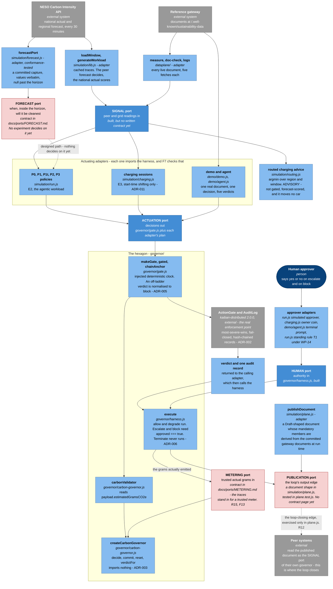
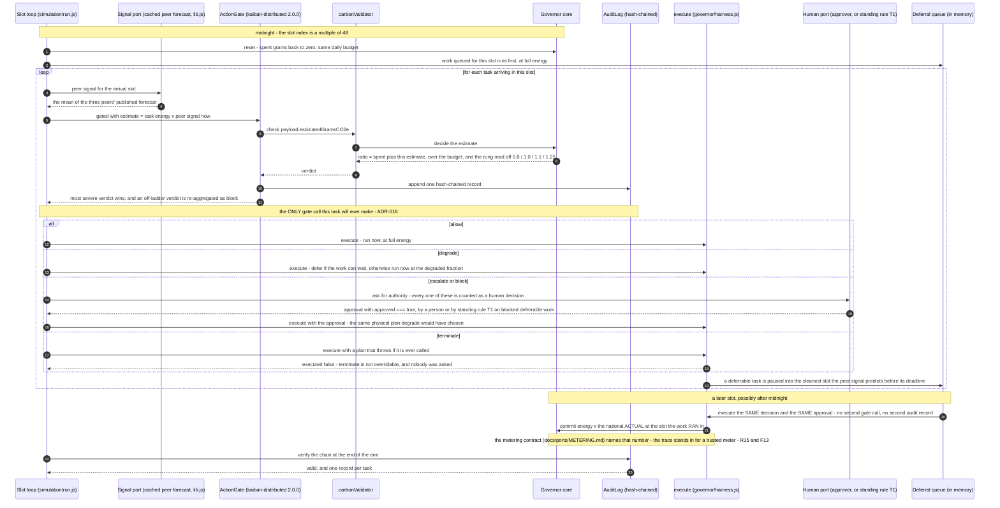
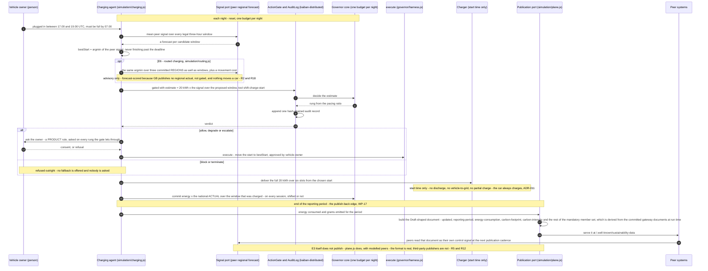
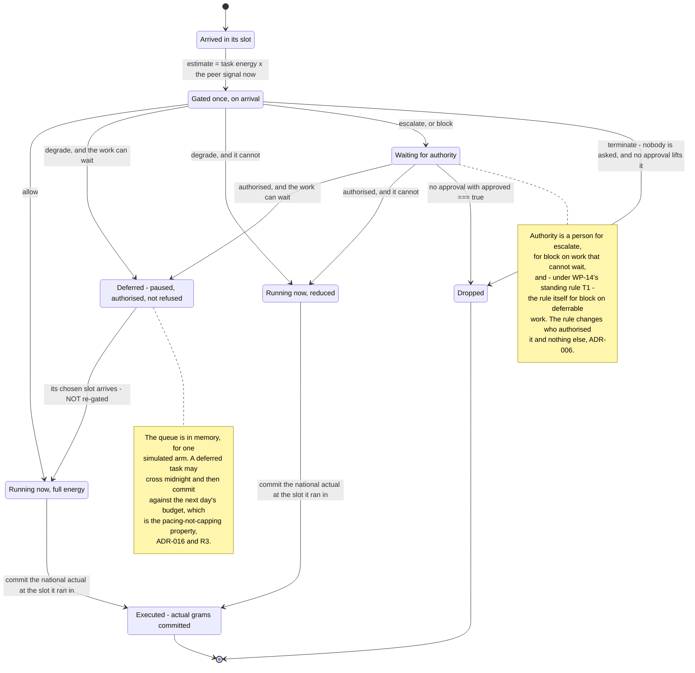
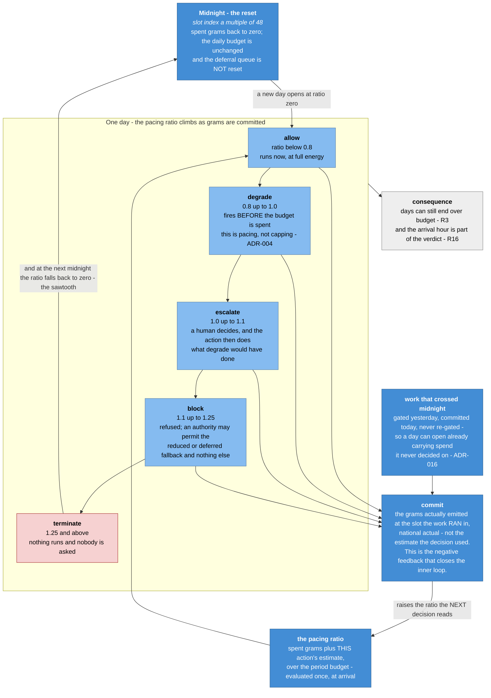

# Dynamic views

The six pictures in [`c4/`](c4/) show what the package *is*. This file shows what it
*does*: one component view of the six ports, two sequence diagrams, one state machine
for the life of a task, and one view of the budget's own dynamics. For a control
system the dynamic view is the interesting one, and until now the package had none
(ROADMAP §4, gap 4; the sequence diagram gap 3 asks for is diagram 3 below).

Every diagram is committed Mermaid source, inline, so it cannot rot silently and needs
no rendering step to read. The conventions are the ones [`c4/README.md`](c4/README.md)
sets: the C4-level view is drawn as a flowchart with each box's role written into its
label, because Mermaid's native `C4Component` renderer stacks the boxes unreadably. As
there: **the pictures are the same thing the words say; if they ever disagree, the code
wins.**

Two labels are used throughout, because the honest reading depends on them:

- **Built** — code in this repository, on the path the scripts actually execute.
- **Designed, not built** — a port or an edge that is specified or shaped here but has
  no adapter on any executed path. Named in the diagram itself, never left to be
  inferred.

| # | Diagram | What it shows |
|---|---|---|
| 1 | [The six ports](#1-c4-level-3--the-six-ports-their-adapters-and-the-gate) | C4 level 3: the governor core, the six ports, every adapter behind them, the real gate, and the data plane |
| 2 | [One E2 gated decision](#2-one-gated-decision-end-to-end-e2) | Task arrival → signal → pacing ratio → rung → gate verdict → approval → execute or defer → metered commit |
| 3 | [One charging session, including publish-back](#3-one-charging-session-including-publish-back-e3--e6--wp-17) | Plug-in → proposal → gate → owner consent → actuation → metered commit → published document → peers read it |
| 4 | [The life of a task](#4-the-life-of-a-task--state-machine) | Arrival → gated → allowed / degraded / deferred / blocked / terminated → executed or dropped |
| 5 | [Budget dynamics](#5-budget-dynamics--the-daily-sawtooth) | The daily sawtooth: spend accumulates, rungs fire at 0.8 / 1.0 / 1.1 / 1.25, midnight resets |

---

## 1. C4 level 3 — the six ports, their adapters and the gate

The hexagon's whole point is that ports compose, so this is the picture of the holes
rather than of the files. Notice that only the **signal**, **human** and **actuation**
ports have adapters on an executed path: the **forecast** port has a written contract
and a conformance adapter that no experiment yet decides with, the **metering** port
has a written contract (`docs/ports/METERING.md`, WP-5) whose reference implementation
is the inlined `exec()`+`commit()` pair — a trusted meter is still what the traces
stand in for, which is exactly what fitness function F13 shows is load-bearing
(R15) — and the **publication** port exists here
only as a document shape inside `simulation/plane.js`. The core in the middle imports
nothing (ADR-003) and the gate it is registered into is the shipped one, not a copy
(ADR-002).

---

## 2. One gated decision, end to end (E2)

This is `simulation/run.js`'s `runP2` as it actually executes. What to notice: **the
gate is called once, on arrival — the verdict is never re-evaluated at execution time
(ADR-016)**, so one task means one verdict and one audit record, which is what makes
"human decisions per day" a number that means anything. Notice too that the decision is
taken on the *peer forecast* an agent can see while the budget is charged with the
*national actual* of the slot the work really ran in, and that the three middle rungs
choose the same physical action — what separates them is who authorised it (ADR-006,
and WP-14's standing rule T1 for the one case it covers).

---

## 3. One charging session, including publish-back (E3, E6 and WP-17)

The strongest worked example: a physical load, a real deadline, and an owner whose
consent matters. What to notice is the **safety inversion** — a gate refusal never
withholds electricity, only the improvement, because `block` and `terminate` fall back
to charging naively with nobody asked (ADR-006's status note, ADR-011) — and that the
owner is asked *first*, on every rung the gate lets through, because whether to move
somebody's car is a product question, not a gate question. The last four messages are
the loop's output edge: they are exercised in `simulation/plane.js` with modelled
peers, not by `charging.js`, which is precisely limitation R12.

---

## 4. The life of a task — state machine

One task, from arrival to executed or dropped, exactly as `runP2` moves it. What to
notice: **stopped, refused and paused are three different things** — `terminate` drops
the task with nobody asked and no approval able to lift it, `block` refuses what was
proposed but lets an authority permit the fallback, and a deferred task is neither, just
paused (ADR-006). The transition out of *Deferred* carries no gate call: it re-uses the
decision and the approval the task was already granted on arrival (ADR-016), which is
also how work committed today can belong to yesterday's decision.

---

## 5. Budget dynamics — the daily sawtooth

The controller in one picture: one number, four thresholds, and a hard reset. What to
notice is that `degrade` fires at 0.8, *before* the budget is spent — the governor paces
rather than caps (ADR-004), which is also why days can still end over budget (R3) — and
that the ratio the ladder reads is evaluated once, at arrival. That last point is what
makes the arrival hour part of the verdict: the same task is allowed at 03.00 and
refused at 23.00 of the same day (R16), and midnight is a discontinuity the work itself
never sees.

---

## Where each diagram comes from

| Diagram | Grounded in |
|---|---|
| 1 | `governor/carbon-governor.js`, `governor/gate.js`, `governor/harness.js`; the adapters in `simulation/`, `dataplane/`, `demo/`; the port list in ROADMAP §3d; the contracts in `docs/ports/FORECAST.md` and `docs/ports/METERING.md`; ADR-002, ADR-003, ADR-005, ADR-006 |
| 2 | `runP2` in `simulation/run.js`, `gated()` in `governor/gate.js`, `execute()` in `governor/harness.js`; ADR-004, ADR-005, ADR-006, ADR-016; WP-14's `tierRules` branch |
| 3 | `governed()` and `bestStart()` in `simulation/charging.js`, `e6()` in `simulation/routing.js`, `publishDocument()` in `simulation/plane.js`; ADR-006, ADR-011; R2, R5, R12, R18 |
| 4 | The plan selection and the deferral queue in `runP2`; `execute()`'s three-line rule; ADR-006, ADR-016 |
| 5 | `verdictFor()` and `DEFAULT_RUNGS` in `governor/carbon-governor.js`, the midnight `reset()` in `runP2`; ADR-004, ADR-016; R3, R16 |
